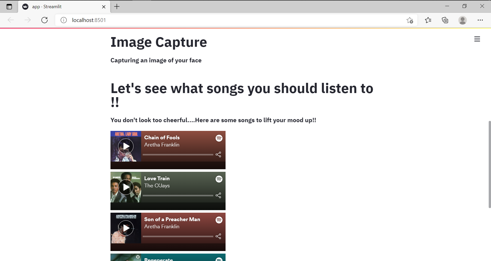

## Music Heals the Soul - HackOn Hackathon 2021
</img>
#### Theme : Mental Wellness

### Introduction

Music Heals the Soul is a Smart Application that recommends songs from Spotify of a particular genre based on the real time emotions of the user.

### What problems does it solve?

We often find it hard to discuss our feelings with others. And so we find solace in music.

Music is often underestimated for its ability make us feel better.

In this project, we have created a live emotion detection algorithm that can predict the emotions of the person in real time and recommend songs to cheer them up!

### Inspiration

The coronavirus pandemic has taken a serious toll on our mental health. And one of the few things that makes us feel good is music.It's something that disconnects us from the grim reality. Music has kept most of us sane during these testing times. One of the greatest qualities of music is the range of emotion in the songs. Each song has been written by the songwriters, who pen their emotions into beautiful songs, and this application hopes to help people relax and listen to songs based on their emotion and mental state at that time.

### Technologies 
- Casscade Classifiers and Webcam input from OpenCV
- A Lightweight Face Recognition and Facial Attribute Analysis Framework Deepface for Emotion Recognition
- Spotify API to fetch songs and playlists based on emotions
- App deployed using Streamlit Python Library

### How DeepFace Work?
Deepface is a hybrid face recognition package. It currently wraps the state-of-the-art face recognition models: VGG-Face , Google FaceNet, OpenFace, Facebook DeepFace, DeepID, ArcFace and Dlib. The default configuration verifies faces with VGG-Face model. You can set the base model while verification as illustared below.
FaceNet, VGG-Face, ArcFace and Dlib overperforms than OpenFace, DeepFace and DeepID based on experiments. Supportively, FaceNet got 99.65%; ArcFace got 99.40%; Dlib got 99.38%; VGG-Face got 98.78%; OpenFace got 93.80% accuracy scores on LFW data set whereas human beings could have just 97.53%.
### How to Run the application:
Make sure you have all the dependencies mentioned in requirements.txt
- Go to the terminal and run the command `streamlit run app.py`
### Screenshots

### Video Demo
<a href = "https://www.youtube.com/watch?v=lJGU6MWG5u8">Click Here</a> **to watch the Video Demo!**

### Next Steps

- [ ] Add Movie Recommendation with IMDB
- [ ] Deployment of the application
- [ ] Speech Seniment Analysis
- [ ] UI/UX Design Improvements
- [ ] Improve Model Efficiency

### Team Members
1. Vedanth Baliga
2. Aaditya Goel
3. Prateek Rao 

